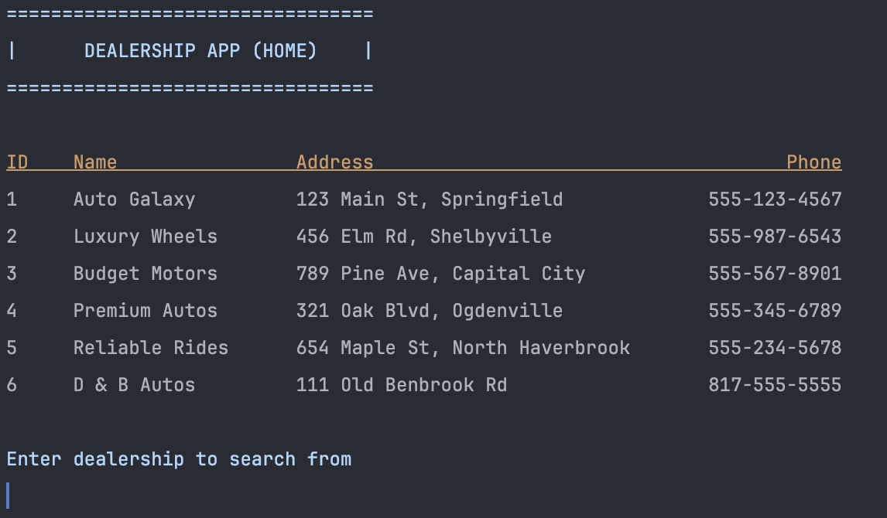
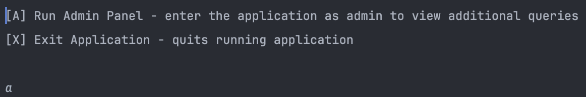
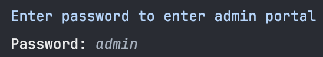
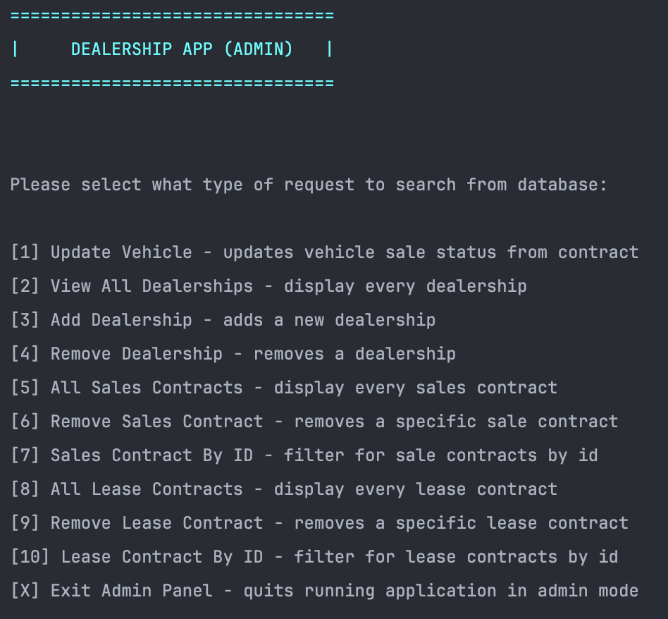
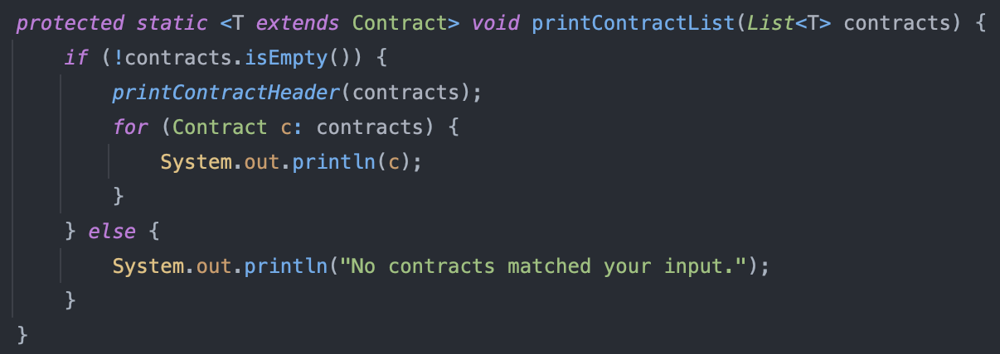

# JDBC Car Dealership 

### A terminal car dealership application with database integration using MySQL Workbench. 

## Home Screen

### ➡️ Features
* Select from multiple dealerships to query from
* Run the application as admin to access additional queries not present in normal mode
* Create new dealerships, vehicles, and contracts from standalone queries or specifying id

## Admin View

### Entering application as admin 
1) Select "Run Admin Panel" from Home Screen (type the letter 'a')

2) Enter "admin" as the password

3) Upon typing the correct password, the admin view should be visible to you

### Interesting Code
Using generics to print out a type of contract list

### Author
Anthony Suarez - https://github.com/asuarezop